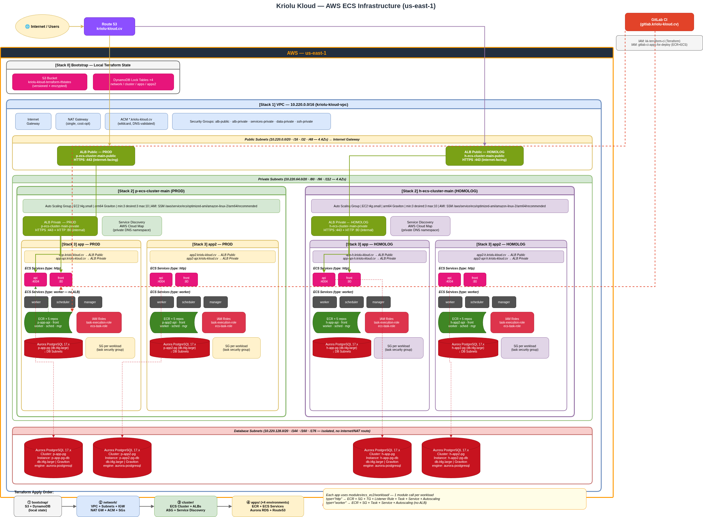

# cluster-ecs-terraform

Terraform infrastructure for **Kriolu Kloud** on AWS — ECS EC2 Graviton clusters, ALBs, VPC, and workloads deployed across two environments (prod + homolog) with two independent applications each.



---

## Stack overview

| # | Stack | What it creates |
|---|---|---|
| 0 | `bootstrap/` | S3 state bucket + DynamoDB lock tables (local state) |
| 1 | `network/` | VPC, subnets (public / private / DB), IGW, NAT GW, ACM, Security Groups |
| 2 | `cluster/` | ECS Clusters, ALB Public + Private, ASG (t4g.small arm64 Graviton), Cloud Map |
| 3 | `apps/` | ECS workloads (front, api, worker, scheduler, manager), Aurora PostgreSQL, Route53 |

Apply order: `bootstrap → network → cluster → apps`

## Modules

All reusable modules live in `modules/`. The key composite is `modules/ecs_ec2/workload/` — one module call deploys an entire workload (ECR + SG + Target Group + Listener Rule + Task Definition + ECS Service + Autoscaling).

See [`modules/README.md`](modules/README.md) for the full catalogue.

## Environments

| Environment | Cluster | App stack |
|---|---|---|
| prod | `p-ecs-cluster-main` | `p-app-*`, `p-app2-*` |
| homolog | `h-ecs-cluster-main` | `h-app-*`, `h-app2-*` |

## Diagrams

| File | Description |
|---|---|
| `infrastructure-overview.drawio` / `.png` | Full AWS infrastructure — all stacks and environments |
| `bootstrap/arch.drawio` | Remote state backend dependency graph |
| `network/arch.drawio` | VPC layout — subnets, IGW, NAT GW, Security Groups |
| `cluster/arch.drawio` | ECS clusters, ALBs, ASG, Capacity Provider |
| `modules/arch.drawio` | Module hierarchy and composition |
| `apps/arch.drawio` | Terraform stack — 4 environments, workloads, Aurora, remote state |
| `apps/service-communication.drawio`* | Service-to-service communication flow (Nginx → ALB → ECS) |

*lives in [`test-apps/docs`](https://gitlab.kriolu-kloud.cv/kriolu-kloud/apps-for-deploy/test-apps/docs)

## Local usage

Terraform is not installed locally — run via Docker to match CI behaviour:

```bash
cd cluster-ecs-terraform/<stack>/environments/<env>

docker run --rm --user "$(id -u):$(id -g)" \
  -v "$(realpath ../..):/workspace" -w /workspace/environments/<env> \
  -e AWS_ACCESS_KEY_ID -e AWS_SECRET_ACCESS_KEY -e AWS_DEFAULT_REGION \
  hashicorp/terraform:1.9 <command>
```

See each stack's `README.md` for stack-specific commands and variables.
